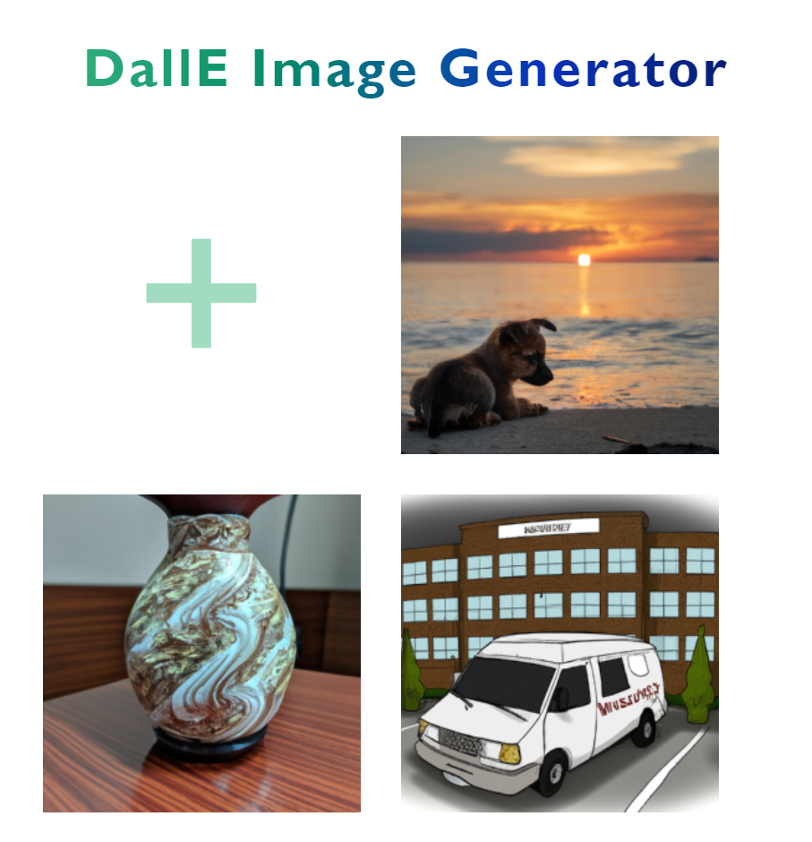

# OpenAI DallE Image Generator Demo


Deployed on [Netlify](https://dall-e.netlify.app/)
[](https://app.netlify.com/sites/dall-e/deploys)
## Project setup
```
npm install netlify-cli -g
netlify login
netlify init
```

### Compiles and hot-reloads for development
```
netlify dev
```

----------
> Get OpenAI API keys [here](https://beta.openai.com/account/api-keys)
